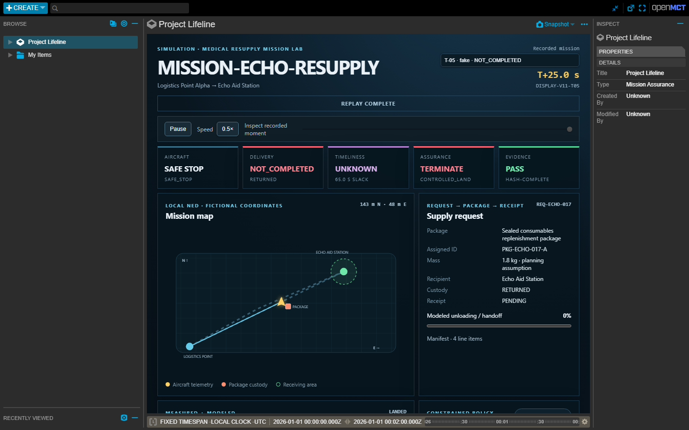

# Project Lifeline — Medical Resupply Mission Lab

Project Lifeline is a student-built systems-engineering lab for studying a complete,
fictional medical-resupply mission: a supply request is accepted, a sealed package is
assigned, a simulated aircraft transports it, a modeled receiving station validates the
handoff, and the system records whether the aircraft recovered, the delivery was accepted,
and the logistics deadline was met.

> Project Lifeline is an independent educational simulation using fictional locations,
> requests, and deadlines. It is not an operational medical system, does not support real
> flight or care decisions, and does not establish safety, certification, or endorsement.



## Why this is more than a drone simulation

The aircraft is one subsystem in a request-to-receipt workflow. Lifeline tracks three
outcomes separately:

| Thread | Question | Example result |
|---|---|---|
| Aircraft | Did the vehicle recover or reach a safe stop? | `RECOVERED` |
| Delivery | Did a matching receiving-station receipt confirm custody transfer? | `ACCEPTED` |
| Timeliness | Was that accepted receipt recorded before the fictional deadline? | `ON_TIME` |

This prevents a common modeling mistake: reaching a waypoint is not treated as proof of
delivery. The simulated handoff requires delivery-zone arrival, landing, an inferred
disarmed state, a five-second unloading dwell, and a matching request/package/recipient
receipt. A recovered aircraft can therefore coexist with `REJECTED`, `UNCONFIRMED`, or
`LATE` delivery results.

The package contains fictional quantities of non-cold-chain consumables: sterile gauze
compresses, wrapped gauze bandages, powder-free nitrile examination gloves, and adhesive
tape. The 1.8 kg package mass is a planning assumption and is not applied to the stock X500
dynamics. See [the logistics basis](docs/medical-logistics-basis.md).

## System architecture

```text
Fictional request + package contract          Scripted fault scenario
                    |                                  |
                    v                                  v
Modeled receiving station <-> mission coordinator -> assurance engine
                    ^                 |                |
                    |                 v                v
          PX4/Gazebo or deterministic source      decision record
                    \_________________|________________/
                                      v
                       hash-linked evidence + FastAPI
                                      |
                                      v
                   read-only Open MCT mission dashboard
```

The assurance package remains independent of PX4, FastAPI, Open MCT, and filesystem
adapters. Simulator actions require loopback allowlisting plus explicit opt-in; the browser
has no mission-control endpoint.

## Run a mission

The easiest launcher is the mission menu:

```powershell
.\scripts\mission.ps1
```

Or select a run directly:

```powershell
# Nominal request-to-receipt mission
.\scripts\mission.ps1 -Scenario T-01 -Mode Synthetic

# Link loss + invalid navigation; RETURN is rejected and delivery is not completed
.\scripts\mission.ps1 -Scenario T-05 -Mode Synthetic

# Aircraft recovers, but the receiving-station receipt is absent
.\scripts\mission.ps1 -Scenario T-13 -Mode Synthetic

# Aircraft recovers, but the receipt names the wrong package
.\scripts\mission.ps1 -Scenario T-14 -Mode Synthetic

# Delivery is accepted after the fictional logistics deadline
.\scripts\mission.ps1 -Scenario T-15 -Mode Synthetic
```

The launcher creates evidence, starts the local API and dashboard, and opens the selected
mission. The dashboard supports pause, 0.5×–4× replay, recorded-moment seeking, coordinated
map/timeline inspection, and **Explain this moment**. It remains read-only.

Replay a completed mission without PX4 or Gazebo:

```powershell
.\scripts\mission.ps1 -Scenario T-01 -Mode Replay
```

## Scenario catalogue and command line

```text
lifeline scenarios list
lifeline scenarios show T-13
lifeline run --scenario T-01 --source fake
lifeline campaign run
lifeline runs list --scenario T-01 --status PASS
lifeline runs show <run-id>
lifeline replay --run <run-id>
lifeline evidence --run <run-id>
lifeline serve --host 127.0.0.1 --port 8000
```

Every new run includes canonical snapshots, decisions, command acknowledgements, delivery
events, the resolved mission contract, assertions, a verification matrix, an after-action
summary, and artifact hashes.

## PX4/Gazebo boundary

PX4 v1.17.0 and Gazebo Harmonic provide the visible X500 aircraft simulation. The v1.1
integration uploads an outbound mission that lands at the fictional receiving station,
executes the modeled handoff, then explicitly rearms, takes off, and returns. Position,
altitude, battery, mode, and flight state come from MAVSDK; confidence, energy feasibility,
custody, receipt, and deadline status are Lifeline models.

The v1.1 qualification uses stock PX4/Gazebo X500 SITL. The nominal run records outbound
travel, observed landing and disarming, modeled unloading, a matching accepted receipt,
observed re-departure, and observed recovery. The compound-fault run records the scripted
Lifeline input degradation separately from unchanged PX4 estimator telemetry.

## Current verification status

- The controlled v1.1 campaign passed all 15 deterministic scenarios, covering nominal
  delivery, compound flight faults, receiver absence, identifier mismatch, and late
  acceptance.
- Python tests cover assurance partitions, delivery semantics, evidence integrity, API
  behavior, launch contracts, and the PX4 safety boundary.
- Frontend tests cover escaping, stale-data behavior, loss of service, and replay completion.
- Historical v1.0 PX4 and display evidence is preserved unchanged.
- New v1.1 PX4 qualification passed for smoke, nominal T-01, and compound-fault T-05.
- Automated v1.1 browser qualification passed 23/23 checks and generated 12 desktop
  and compact screenshots, including temporal replay and compact-layout checks.

Project Lifeline is released under the MIT License. Requirements, hazards, traceability,
CONOPS, discrepancies, and upstream component provenance are maintained as versioned
engineering artifacts in `docs/`, `engineering/`, and `THIRD_PARTY.md`.
