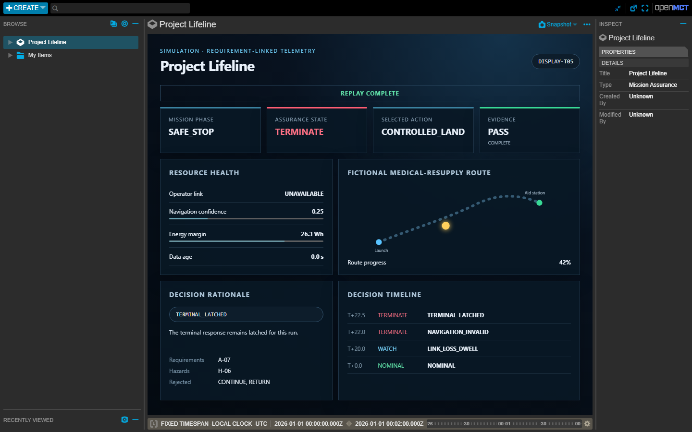

# Project Lifeline

Project Lifeline is a student-built systems-engineering and simulation project for a
fictional medical-resupply drone. It connects a deterministic assurance engine to
scripted fault scenarios, PX4/Gazebo software-in-the-loop, a read-only Open MCT
dashboard, and requirement-linked evidence that can be replayed and independently
checked.

> Project Lifeline is an independent educational simulation using fictional mission data.
> It is not an Army system, is not endorsed by the U.S. Army, does not model a fielded
> operational capability, and is not intended to support real flight or medical decisions.



## What the project demonstrates

- A pure Python assurance engine with explicit states, priorities, dwell timers, and
  irreversible decisions.
- Twelve deterministic scenarios covering link, navigation, energy, and stale-data
  conditions.
- A visible PX4 v1.17.0 and Gazebo Harmonic X500 simulation.
- A read-only Open MCT console for live telemetry, decisions, rejected alternatives,
  requirements, hazards, and historical replay.
- Append-only evidence bundles with SHA-256 integrity checks and sanitized public
  derivatives.
- Automated Python, schema, PowerShell, browser, replay, and fresh-archive qualification.

## Architecture

```text
PX4 SITL + Gazebo X500
          |
       MAVLink
          |
MAVSDK adapter -> canonical telemetry -> assurance engine
                                           |
                              evidence recorder + FastAPI
                                           |
                               Open MCT live/replay console
```

The assurance package stays independent of PX4, FastAPI, Open MCT, and filesystem
adapters. Browser access is read-only, while simulator actions require a loopback-only
endpoint, an enabled qualification profile, and an explicit launcher token.

## T-05 compound-fault example

T-05 begins as a normal outbound mission, then injects modeled link loss and navigation
degradation into the assurance inputs. Because navigation is invalid, the engine rejects
`RETURN`, selects `CONTROLLED_LAND`, and records the triggering fields, rejected
alternative, requirements, hazards, and action acknowledgement. The simulated vehicle
finishes in `SAFE_STOP`.

The injected assurance-input faults are distinct from the physical MAVSDK telemetry
source. This is modeled behavior in software-in-the-loop, not a real-flight result.

## Quick start

```powershell
py -3.11 -m venv .venv
.\.venv\Scripts\python -m pip install -e ".[dev]"
.\.venv\Scripts\lifeline --json doctor
.\.venv\Scripts\lifeline validate
.\scripts\demo.ps1 -Scenario T-05 -Mode Fake
```

Open <http://127.0.0.1:8766/> after the launcher reports readiness. Evidence is written
to `evidence/runs/<run-id>/`.

Replay the committed synthetic reference without PX4 or Gazebo:

```powershell
.\scripts\demo.ps1 -Scenario T-05 -Mode Replay
```

If the default loopback ports are occupied:

```powershell
.\scripts\demo.ps1 -Scenario T-05 -Mode Replay -ApiPort 8875 -WebPort 8876
```

## PX4/Gazebo qualification

The live configuration uses Ubuntu 24.04 in WSL2 so PX4, MAVSDK, Lifeline Python, and
the API share true loopback. Windows hosts the read-only dashboard.

```powershell
.\scripts\setup-px4-wsl.ps1
.\scripts\qualify-px4.ps1 -Scenario Smoke
.\scripts\qualify-px4.ps1 -Scenario T-01
.\scripts\qualify-px4.ps1 -Scenario T-05
```

`config/baseline.yaml` remains fail-closed. The qualification profile may differ only
by `actions_enabled: true`; the code also enforces loopback, explicit authorization,
a nonzero simulator UUID, and dashboard readiness before mission release.

## Command reference

All commands accept the global `--json` flag before the subcommand. JSON success uses
`{"ok": true, "data": ...}`; failure uses
`{"ok": false, "error": {"type": ..., "message": ...}}` and a nonzero exit code.

```text
lifeline --json doctor
lifeline validate
lifeline run --scenario T-01 [--source fake|px4]
lifeline live --scenario T-01 --config config/sitl-qualification.yaml
lifeline px4-smoke --config config/sitl-qualification.yaml
lifeline campaign run
lifeline campaign audit
lifeline runs list
lifeline runs show <run-id>
lifeline evidence --run <run-id>
lifeline evidence --run <run-id> --export-public <staging-root>
lifeline figure --run <run-id>
lifeline replay --run <run-id>
lifeline serve [--host 127.0.0.1] [--port 8000]
lifeline inject --field navigation_confidence --value 0.25 --exploratory
```

## Verified results

- 12/12 controlled fake-source scenarios pass their frozen assertions.
- T-01 completes `RECOVERED` in PX4 SITL.
- T-05 completes `SAFE_STOP`, rejects `RETURN`, and records the controlled-land
  acknowledgement.
- Automated display qualification passes 15/15 assertions at desktop and compact
  viewports with eight hash-checked screenshots.
- The release audit verifies committed evidence from a fresh Git archive.

These results establish behavior for the documented simulation and test configuration.
They do not establish operational safety, real-flight performance, certification, or
human usability.

## Project documentation

The `docs/` directory contains the CONOPS, architecture, interface contract, decision
policy, verification plan, discrepancies, project status, and claim-evidence register.
Requirements, hazards, traceability, scenarios, and generated schemas are maintained as
version-controlled engineering artifacts.

Project Lifeline is released under the MIT License. Upstream component versions and
licenses are documented in `THIRD_PARTY.md`.
