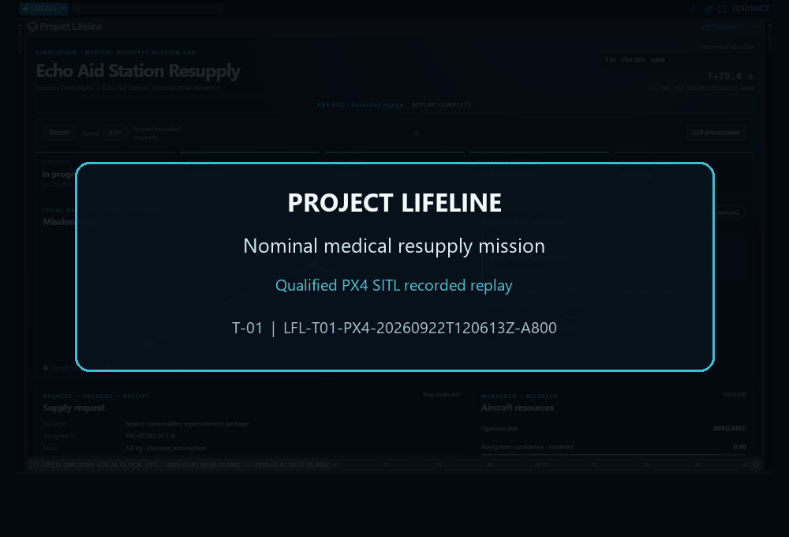
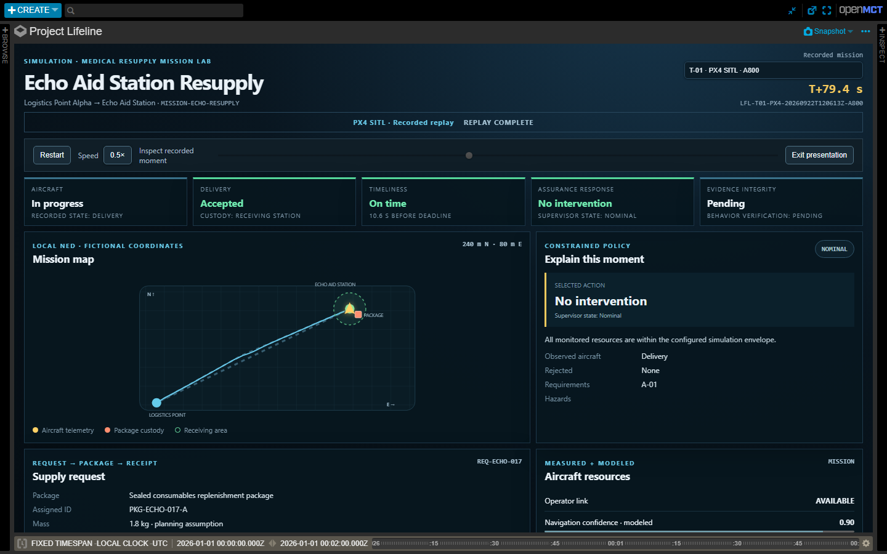
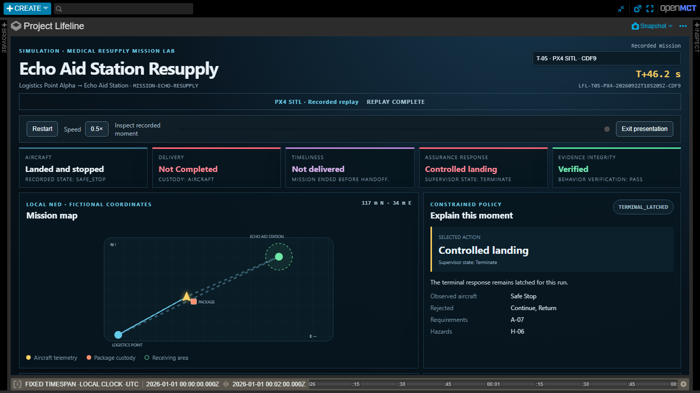

# Project Lifeline

*A medical resupply mission lab built with PX4, Gazebo, Open MCT, and a deterministic assurance engine.*

Project Lifeline follows a fictional medical supply request from assignment to receipt. A PX4 X500 flies the route in Gazebo, a receiving-station model checks the package handoff, and a read-only Open MCT dashboard explains what the assurance logic knew at each point.

> This is an independent student simulation. It uses fictional locations, requests, supplies, and deadlines. It does not support real flight or medical decisions, and its results are not safety validation or certification.

[](docs/demo-walkthrough.md)

*A recorded replay of the qualified PX4 SITL T-01 run. The dashboard separates simulator observations from the modeled receiving-station handoff.*

## What the project models

The aircraft is one part of a larger request-to-receipt workflow. The simulation tracks the supply request, package identity, aircraft state, receiving station, custody transfer, receipt, and delivery deadline.

A mission moves through five observable stages:

1. A fictional request is matched to a sealed package and a receiving station.
2. The aircraft departs and travels to the delivery zone.
3. PX4 telemetry confirms arrival, landing, and disarming.
4. The receiving-station model completes a five-second unload dwell and checks the request, package, mission, and recipient identifiers.
5. The evidence record reports the aircraft, delivery, and timeliness outcomes separately.

Reaching a waypoint does not count as delivery. Lifeline requires an observed landing and disarm, the modeled unload dwell, and a matching receipt before it reports an accepted handoff.

| Outcome | Question answered | Example |
|---|---|---|
| Aircraft | Did the vehicle recover or stop after a contingency? | `RECOVERED` |
| Delivery | Did the receiving station accept the assigned package? | `ACCEPTED` |
| Timeliness | Did acceptance occur before the fictional deadline? | `ON_TIME` |

The package manifest uses fictional quantities of gauze, bandages, examination gloves, and adhesive tape. Its 1.8 kg mass is a planning assumption and is not applied to the stock X500 dynamics. The reasoning behind that choice is documented in [the logistics basis](docs/medical-logistics-basis.md).

## Why this mission matters

Army organizations are actively exploring uncrewed aircraft for last-mile medical resupply in dispersed and austere settings. Recent examples include the [44th Medical Brigade's simulated resupply training](https://www.army.mil/article/292841/44th_medical_brigade_integrates_drones_into_medical_resupply_operations) and the [West Point medical-resupply research project](https://www.army.mil/article/284898/west_point_cadets_pilot_drone_innovation_for_medical_resupply). Lifeline studies the software-assurance and evidence problem around that mission idea. It does not model Army doctrine, threat systems, protected communications, airspace approval, medical product handling, or field operations, and it has no Army affiliation or endorsement.

## Two runs to open first

### T-01: nominal delivery and recovery

Qualified run `LFL-T01-PX4-20260922T120613Z-A800` records the complete mission thread:

- travel from Logistics Point Alpha to Echo Aid Station;
- arrival inside the delivery zone;
- observed landing and disarming;
- modeled unloading and a matching accepted receipt;
- rearming, departure, return flight, and observed recovery.

Its final outcomes are `RECOVERED`, `ACCEPTED`, and `ON_TIME`.



### T-05: compound fault before handoff

Qualified run `LFL-T05-PX4-20260922T185205Z-CDF9` introduces link loss followed by invalid navigation before the delivery handoff. The policy rejects `RETURN` because navigation cannot be trusted, commands a controlled landing, and waits for telemetry to confirm that the aircraft has landed.

The run ends in `SAFE_STOP` with delivery `NOT_COMPLETED`. Package custody remains `AIRCRAFT` because no delivery or return handoff occurred. The injected confidence values affect Lifeline's assurance inputs only; the underlying PX4 estimator remains unchanged.



## Run it

The mission menu is the simplest entry point:

```powershell
.\scripts\mission.ps1
```

You can also choose a scenario and source directly:

```powershell
# Nominal request-to-receipt simulation
.\scripts\mission.ps1 -Scenario T-01 -Mode Synthetic

# Compound link and navigation fault
.\scripts\mission.ps1 -Scenario T-05 -Mode Synthetic

# Qualified PX4 replays
.\scripts\mission.ps1 -Scenario T-01 -Mode Replay -RunId LFL-T01-PX4-20260922T120613Z-A800
.\scripts\mission.ps1 -Scenario T-05 -Mode Replay -RunId LFL-T05-PX4-20260922T185205Z-CDF9
```

The launcher creates or selects the evidence, starts the local API and Open MCT application, then opens the dashboard. Replay controls include Play, Pause, Restart, speed selection, recorded-moment seeking, and a presentation mode. "Explain this moment" reconstructs only the information available at the selected time.

After the launcher starts, [open the local Open MCT dashboard](http://127.0.0.1:8766/?run=LFL-T01-PX4-20260922T120613Z-A800#/browse/lifeline:mission-assurance). This link uses the API running on your computer; GitHub does not host the simulation service.

The command-line interface exposes the same runs and scenarios:

```text
lifeline scenarios list
lifeline scenarios show T-13
lifeline run --scenario T-01 --source fake
lifeline campaign run
lifeline runs list --scenario T-01 --status PASS
lifeline runs show <run-id>
lifeline replay --run <run-id>
lifeline evidence --run <run-id>
lifeline serve --host 127.0.0.1 --port 8000
```

## Architecture

```text
Fictional request and package             Scripted fault scenario
                 |                                  |
                 v                                  v
Modeled receiving station <-> mission coordinator -> assurance engine
                 ^                 |                 |
                 |                 v                 v
       PX4/Gazebo or deterministic source       decision record
                 \_________________|_________________/
                                   v
                    hash-linked evidence + FastAPI
                                   |
                                   v
                read-only Open MCT mission dashboard
```

The assurance package has no dependency on PX4, FastAPI, Open MCT, or filesystem adapters. PX4 actions require an allowlisted loopback endpoint and explicit opt-in. The browser has no endpoint that can arm, launch, return, land, or inject a fault.

Every run records snapshots, decisions, command acknowledgements, delivery events, the resolved mission contract, assertions, an after-action summary, and artifact hashes. The dashboard uses that same data for live display and historical replay.

### Where the project work sits

The original engineering work is the Lifeline layer: the mission contract, receiving-station and custody model, assurance policy, deterministic scenario harness, verification oracle, evidence pipeline, guarded MAVSDK adapter, Open MCT plugin, and launch tooling. PX4, Gazebo, MAVSDK, and Open MCT are upstream projects used through documented interfaces. Their versions and licenses are recorded in [THIRD_PARTY.md](THIRD_PARTY.md).

## Verified results

The final v1.1 evidence set contains:

- a 15-scenario deterministic campaign with 15/15 passing runs;
- PX4/Gazebo qualifications for smoke, nominal T-01, and compound-fault T-05;
- 59 passing Python tests with 75.24% total coverage;
- 27/27 automated browser display checks;
- 12 synthetic qualification screenshots and four captures from qualified PX4 replays;
- a clean release audit and a passing fresh-archive audit.

The display checks cover stale and unavailable data, temporal replay, HTML escaping, compact layouts, source labeling, presentation mode, and the absence of browser-side flight controls. They are automated checks, not a human usability study.

### What qualification establishes

| Evidence | What it establishes | What it does not establish |
|---|---|---|
| 15/15 deterministic scenarios | The implemented policy produced the declared outcomes for the 15 modeled input sequences. | Coverage of weather, terrain, contested spectrum, hardware faults, or unmodeled operational conditions. |
| PX4 smoke, T-01, and T-05 | The guarded MAVSDK path worked with a stock X500 in PX4/Gazebo SITL, including observed mission progress and landing states. | Real aircraft behavior, payload effects, flightworthiness, or a degraded PX4 estimator. |
| 27 browser checks | The recorded data, failure labels, replay controls, and read-only boundary behaved as asserted in Chromium. | Human-factors validation or operator effectiveness. |
| Hash-complete release audit | The retained artifacts, configuration, assertions, and trace links are internally consistent and reproducible from the repository. | Safety approval, certification, clinical suitability, or Army endorsement. |

See [project status](docs/project-status.md), [the demonstration walkthrough](docs/demo-walkthrough.md), and [the claim-evidence register](docs/claim-evidence-register.md) for the run IDs and acceptance boundaries.

## Limits

Project Lifeline is limited to its fictional simulation configuration. It does not establish clinical suitability, real-flight performance, operational safety, certification, military capability, or endorsement. The stock X500 dynamics do not include the modeled package mass, and the scripted T-05 fault changes Lifeline's assurance inputs rather than the PX4 estimator.

## Repository map

| Path | Contents |
|---|---|
| `src/lifeline/assurance` | Simulator-independent assurance policy |
| `src/lifeline/delivery.py` | Receiving-station, receipt, custody, and deadline model |
| `scenarios/` | Fifteen deterministic scenario definitions |
| `requirements/` | Requirements, hazards, and traceability |
| `openmct/` | Read-only mission dashboard and browser qualification |
| `evidence/` | Final controlled campaign, display fixtures, and sanitized PX4 evidence |
| `docs/` | Architecture, interfaces, discrepancies, and verification records |

Project Lifeline is released under the MIT License. Upstream versions and licenses are listed in [THIRD_PARTY.md](THIRD_PARTY.md).
