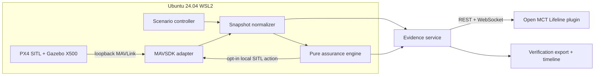

# Architecture

The normalizer is the only boundary allowed to combine vehicle telemetry and synthetic
conditions. The assurance package depends only on domain models and configuration.
Evidence is append-only during a run. Live and replay sources publish the same canonical
message envelope. A live mission is held at `READY` until the dashboard WebSocket is
connected and a localhost launcher presents a one-time token. That POST endpoint is never
exposed to Open MCT. Reconnection uses an explicit last sequence so buffered history is
followed by live records without duplication.
