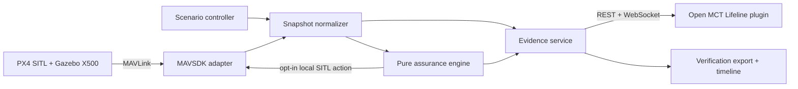

# Architecture

The normalizer is the only boundary allowed to combine vehicle telemetry and synthetic
conditions. The assurance package depends only on domain models and configuration.
Evidence is append-only during a run. Live and replay sources publish the same canonical
message envelope.

